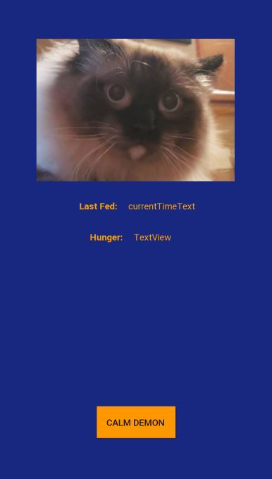

# Chonk Tracker
This android application is a passion project as an excuse to explore mobile development, dynamic state changes, and persistent storage. The applications main purpose to is track and record the last time my cat was fed, since my roommate and I constantly have to ask each other if they have fed the cat. He can be quite the convincing actor at times. To build, open the application in Android Studio and use the gradle files to build. To install the app, simply download the app > release > ChonkTracker.apk and install onto the desired android powered device. 

Chonk Tracker support versions of Android as far back as Jellybean, and should run on screen sizes from the razer 5 to the Pixel XL.

